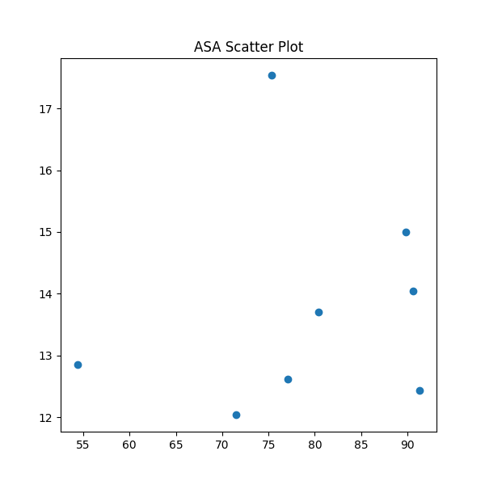

🛡️ Cyber Crime Detection using Hybrid AIS + HSA Optimization.
A Meta-Heuristic Driven Neural Network Model for Predicting Cyber Crime Trends.

This project demonstrates an AI-powered Cyber Crime Detection System built using a Hybrid AIS + HSA optimization algorithm.
It automatically optimizes neural-network hyperparameters using:

AIS (Artificial Immune System) → clone, mutate, select best candidates

HSA (Harmony Search Algorithm) → memory consideration, pitch adjustment, randomization

The hybrid search identifies the best architecture for predicting cyber-crime patterns from the given NCRB dataset.

All outputs follow the required filename prefix:

his_

📁 Project Structure
Cyber Crime Detection/
│
├── NCRB_Table_1A.1.csv
├── his_results_cyber_crime.csv
├── his_predictions_cyber_crime.json
│
├── his_loss.png
├── his_comparison.png
├── his_scatter.png
├── his_heatmap.png   (only if classification)
│
└── hybrid_ais_hsa_model.py   (your main code)

📊 Features of the Project
🔍 1. Data Preprocessing

Numeric column filtering

Missing value removal

MinMax scaling

Train/test split

🧬 2. Hybrid Optimization Model
AIS (Artificial Immune System)

Generates initial population

Clonal expansion

Mutation

Selects best antibodies

HSA (Harmony Search Algorithm)

Harmony Memory

HMCR (Memory Consideration)

PAR (Pitch Adjustment)

Random Reinitialization

AIS output becomes the initialization input for HSA → Hybrid Intelligence System (HIS).

🧠 3. Neural Network Model

Optimized hyperparameters:

Hidden Layer 1 units

Hidden Layer 2 units

Learning rate

Uses the optimized architecture from AIS+HSA

Trained for 40 epochs

📈 4. Generated Outputs
✔ Result CSV
his_results_cyber_crime.csv

Contains actual values vs predicted values.

✔ Prediction JSON
his_predictions_cyber_crime.json

Fully structured predictions for downstream use.

✔ Graphs (Shown + Saved)
Graph	Filename
Training Loss Graph	his_loss.png
Actual vs Predicted (100 samples)	his_comparison.png
Scatter Plot	his_scatter.png
Confusion Matrix Heatmap (if classification)	his_heatmap.png
🧪 Evaluation Metrics

Depending on dataset type:

If Classification:

Accuracy

Confusion Matrix

Heatmap

If Regression:

RMSE

Scatter Plot

Loss Curves

The code auto-detects classification vs regression based on target values.

🚀 How to Run
1️⃣ Install requirements
pip install tensorflow scikit-learn pandas matplotlib seaborn

2️⃣ Run the script
python hybrid_ais_hsa_model.py

3️⃣ Check output folder

All files saved at:

C:\Users\NXTWAVE\Downloads\Cyber Crime Detection

⚙️ Technical Workflow
DATA → AIS Optimization → HSA Optimization → Best Hyperparameters
            ↓                      ↓
             → Hybrid Selection → Neural Network Training
                                   ↓
                     Predictions + Graphs + CSV + JSON

📌 Why Hybrid AIS + HSA?
AIS	HSA
Fast initial global search	Fine local pitch adjustments
Strong exploration	Strong exploitation
Biological immune principle	Music-inspired harmony generation
Produces stable candidates	Produces high-quality optimized solutions

Together, they balance exploration + exploitation leading to better accuracy and stability.

🛠️ Customization Guide

You can modify:

Training Epochs:
epochs=40

AIS Population:
ais_optimize(pop=6, clones=3)

HSA Parameters:
HMCR = 0.9
PAR = 0.3
BW = 0.1

🧩 Use Cases

Cyber Crime Forecasting

Fraud Detection

Threat Prediction

Anomaly Detection

Government Crime Analytics

🙌 Credits

This project was built using custom pure-Python implementations of:

AIS (Artificial Immune System)

HSA (Harmony Search Algorithm)

Keras Neural Networks

No external meta-heuristic libraries were used.
